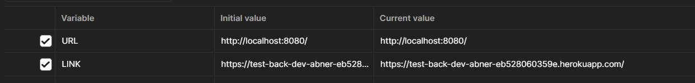

# REST API (Test BackEnd Dev)

Esta es mi propuesta de desarrollo para la vacante de  Back-End Developer.

## Requerimientos

- Node.js =< `v21.6.1` 
- NPM =< `10.4.0`
- Git =< `2.43.0`
- Github account

## Instrucciones

Descargar repositorio

```bash
git clone https://github.com/abnerlol68/test_back_dev.git
```

o con SSH

```bash
git clone git@github.com:abnerlol68/test_back_dev.git
```

Acceso al directorio

```bash
cd test_back_dev
```

Instalacción de paquetes y arranque del servidor para el desarrollo

```bash
npm i
npm run dev
```

## Postman collection

```bash
./test_back_dev.postman_collection.json
```

Existen dos principales variables en la colección de peticiones de postman donde `URL` corresponde a la dirección del servidor en local y `LINK` para el servidor en deploy.



## Links de deploy

[Heroku deploy](https://test-back-dev-abner-eb528060359e.herokuapp.com/)

## Requests Docs

Docs UI

```bash
/api/v1/docs
```

Docs in JSON

```bash
/api/v1/docs.json
```

## Environment Variables

El proyecto requiere de dos principales variables: 

- `DATABASE_URL` - String para la conección a una base de datos
- `PORT` - Número del puerto que se quiere o se puede ocupar

Consulta el archivo `.env.example` para ver que colocar en tu propio `.env` o en las variable que se coloque en la configuración donde se realiza el deploy.